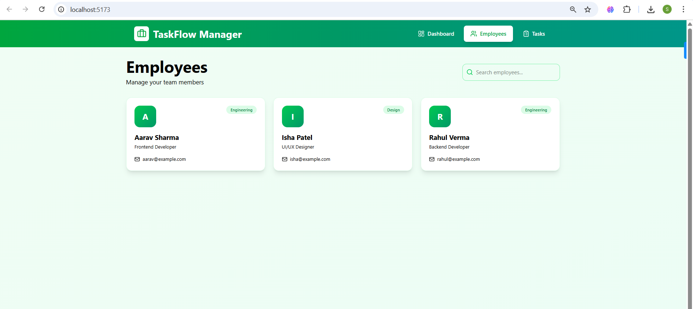
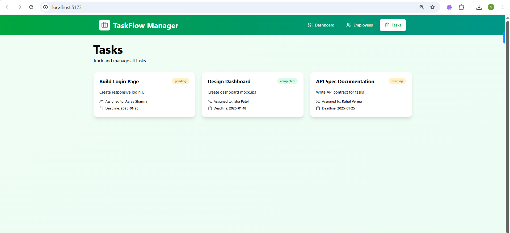

# Taskflow Manager – Frontend (Track 1)

This is a simple and responsive Employee Task Manager built using React + Vite + Tailwind CSS.
The goal of this track was to create a clean, functional frontend that works entirely on mock JSON data, without any backend or database.

The application includes a dashboard, employee listing, and task listing — all built with reusable components and basic UI interactions.

# What’s Inside

A neat, responsive UI made with Tailwind

Mock JSON files for employees and tasks

Dashboard with basic statistics

Search option on the employees page

Task list with assigned employee names

React Router for navigation

Component-based structure for clean code

Even though this is a mock frontend, I designed it in a way that it can easily connect to real APIs later.

# Tech Stack

React (Vite)

Tailwind CSS

React Router

Mock JSON data

# Folder Structure Overview

src/

components/ : Navbar, EmployeeCard, TaskCard

pages/ : Dashboard, Employees, Tasks

data/ : employees.json, tasks.json

App.jsx

main.jsx

index.css

# Running the Project Locally

Clone or download the repo, open the folder, and run:

npm install

npm run dev

Then open the URL shown in the terminal (usually http://localhost:5173/).

# Screenshots
### Dashboard

### Employees Page

### Tasks Page

# A Few Notes
No backend is used in this track — everything comes from local JSON files.

Task cards automatically map the “assignedTo” field to the corresponding employee.

This frontend is built to be easily pluggable into a real backend (Track 2).

# Why This Works Well

The objective was to demonstrate:

Clean code

Good component structure

Basic UI/UX

Ability to work with mock data

Professional folder organization
